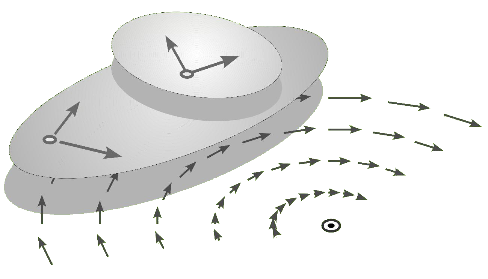

#  Mechanismentechnik

Dieses Repository beinhaltet Musterlösungen für die Aufgaben aus dem Buch Mechanismentechnik (ISBN: 978-3-8325-4362-4).

Im Projekt findet sich eine Auflistung des Fortschritts des [Projektes](https://github.com/goessner/Mechanismentechnik/projects/1) und der entsprechenden Aufgaben.

