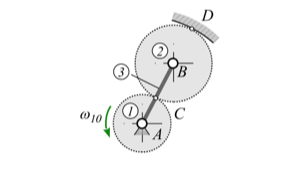

## 1.8 Relativbewegung

Wenn Drehgelenke angetrieben werden, ist die Drehzahl des angetriebenen Glieds anhand des vorliegenden Winkelgeschwindigkeitsverlaufs zu jedem Zeitpunkt bekannt. Ist nun das andere &ndash; am Gelenk beteiligte &ndash; Glied seinerseits beweglich, sind die Gesetzmäßigkeiten der Relativbewegung anzuwenden. Dies gilt grundsätzlich für gesuchte Winkelgrößen und deren zeitliche Ableitungen aus Sicht beweglicher Glieder. Insbesondere kann hierbei sie *3-Ebenen Gleichung* vorteilhaft eingesetzt werden [(vgl. Gössner 2017, S.81 f.)](#goessner2017).

<figure>

#### Abb. 1.8: Planetenradstufe

</figure>

Die Vorgehensweise wird am Beispiel einer Planetenradstufe (Abb. 1.8) näher erläutert. Das Sonnenrad *1* und das Planetenrad *2* stehen miteinander im Eingriff. Ihre Wälzkreise berühren sich im Punkt $C$ und Steg *3* verbindet deren Mittelpunkte drehgelenkig. Das Hohlrad *0* ist gestellfest und hat im Punkt $D$ den gemeinsamen Wälzpunkt mit Rad *2*. Die Geschwindigkeit des Punkts $B$ lautet nach Euler

$$\bm v_B = \omega_{30}(r_1+r_2)\bm{\tilde e}_{AB}$$

Im punkt $C$ gilt die Gleichheit der Geschwindigkeiten von Glied *1* und *2*.

$$\omega_{10}r_1\bm{\tilde e}_{AB} = \bm v_B-\omega_{20}\bold r_2\bm{\tilde e}_{AB}$$

Die Geschwindigkeit im Punkt $D$ muss wegen der Wälzbedingung verschwinden.

$$\bm 0 = \bm v_B+\omega_{20} r_2 \bm{\tilde e}_{AB}$$

Aus diesen letzten Gleichungen lässt sich $\bm v_B$ entfernen und wegen der gleichen Richtung aller Vektoren in skalarer Form schreiben

$$\omega_{20} = -2\omega_{10}\frac{r_2}{r_1}.$$

Die erste Gleichung liefert damit

$$\omega_{30} = -2\omega_{10}\frac{r_2}{r_1+r_2}.$$
 
Aus den nun gegebenen absoluten Winkelgeschwindigkeiten kann beispielsweise die relative Winkelgeschwindigkeit $\omega_{23}$ mit der 3-Ebenen Gleichung gefunden werden. Aus
 
$$\omega_{02}+\omega_{23}+\omega_{30} = 0$$
 
erhalten wir

$$\omega_{23} = \omega_{20}-\omega_{30} = ... = 2\omega_{10}\frac{r_2^2}{r_1(r_1+r_2)}$$

Die sog. *Standübersetzung* $s$ des Umlaufrädergetriebes bezieht die Winkelgeschwindigkeiten von Sonnen- und Hohlrad auf den ruhend angenommenen Steg

$$s = \frac{\omega_{23}}{\omega_{03}} = -\frac{r_2}{r_1}$$

Die Relativkinematik lässt sich genauso gut zur Analyse ungleichförmiger Getriebe anwenden.

## References

Gössner, S., 2017. Mechanismentechnik: Vektorielle Analyse ebener Mechanismen. Berlin: Logos