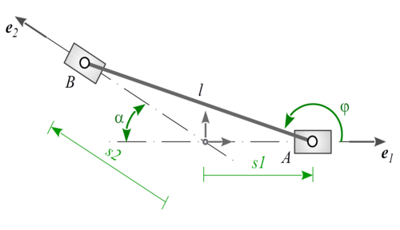

## 6.2 Grundfall II/III

### 6.2.1 Aufgabenstellung

Analysieren Sie den Mechanismus und stellen Sie ihn anschließend mit g2 interaktiv im Browser dar.

<figure>


#### **Abb. 6.2:** Gegebener Mechanismus

</figure>

**Geg.:** $\quad l = 100mm$, $\alpha = 30°$, $s=\left\{\begin{array}{ll} > -\ 150\ mm\\ < \quad 190\ mm \end{array}\right.$ 
 
**Lösung:**

Um den Mechanismus interaktiv in ein Canvas zu rendern benötigen wir die Koordinaten der Punkte A und B in Abhängigkeit der Laufvariable s1.

### 6.2.2 Mathematik

Aufstellen der Maschengleichung und Sortieren nach Bekannten und Unbekannten liefert Grundfall II:

$$s_1\bm e_1 + l\bm e_\varphi − s_2\bm e_2 = \bm 0\quad |\cdot(−1)\quad\Harr\quad \underline{s_2}\bm e_2 − l\underline{\bm e_\varphi} = \bm g$$

mit

$$\bm g = s_1\bm e_1 = s_1\bm e_x = \binom{s_1}{0}$$

> Nimmt man bei dem selben Mechanismus z.B. den Winkel $\varphi$
als bekannt und $s_1$ oder $s_2$ als unbekannt an, lässt sich Grundfall III identifizieren. Die Lösung von diesem erfolgt analog.

$\bm e_2$ ist uns durch das gegebene $\alpha$ implizit bekannt mit

$$\bm e_2 = \binom{\cos(\pi-\alpha)}{\sin(\pi-\alpha)}$$

und da $l$ mit $100mm$ gegeben ist, identifizieren wir Grundfall II mit $s_2$ und $\bm e_φ$ als Unbekannte.

> #### **Grundfall II**
> $$\underline{a}\bm e_\alpha - b\underline{\bm e_\beta} = \bm c$$
> #### **Lösungen**
> $$a = \bm c\cdot\bm e_\alpha\pm\sqrt{b^2 - (\bm c\cdot\tilde\bm e_\alpha)^2}\qquad und\qquad \bm e_\beta = \frac{a\bm e_\alpha - \bm c}{b}$$

Mit getauschten Variablen ergeben sich für unseren Mechanismus die Lösungen:

$$s_2 = \bm g\cdot\bm e_2 \pm\sqrt{l^2 - (\bm c\cdot\tilde\bm e_2)^2}\qquad und\qquad\bm e_\varphi = \frac{s_2\bm e_2 - \bm g}{l}$$

Daraus folgt wiederum der Winkel $\varphi$

$$\varphi = \arctan_2\left[\frac{1}{l}(s_2\cdot e_{2y})\ ,\ \frac{1}{l}(s_2\cdot e_{2x} - s_1)\right]$$

### 6.2.3 Code

Da alle notwendigen Analysen nun getätigt wurden kann mit der Umsetzung in HTML und JavaScript begonnen werden. Wir erstellen ein 450x300px Canvas, einen Range-Input für `s1` sowie die üblichen globalen JS Variablen inklusive folgendem mec-Objekt:

```JavaScript
mec = {
        l: 100,
        alpha: 30*pi/180,
        get g() { return {x:s1, y:0}; },
        get e2() { return {x:Math.cos(pi - this.alpha), y:Math.sin(pi - this.alpha)} },
        get s2() { var ge2  = this.g.x*this.e2.x + this.g.y*this.e2.y,
                       ge2g = (this.g.x*(-this.e2.y) + this.g.y*this.e2.x); 
                   return ge2 + Math.sqrt( this.l*this.l - ge2g*ge2g ); },
 
        // eigentlich nicht benoetigt           
        get phi() { return Math.atan2( (1/this.l)*this.s2*this.e2.y, (1/this.l)*this.s2*(this.e2.x - s1) ); },     
        get ephi() { return {x:Math.cos(this.phi), y:Math.sin(this.phi)}; },
 
        // Gelenkpunkte
        get A() { return {x:s1, y:0}; },
        get B() { var s2 = this.s2; return {x:s2*this.e2.x, y:s2*this.e2.y}; }
    },
```

Die Getter für `phi` und `ephi` werden von uns eigentlich nicht gebraucht da wir an den Punkt $B$ auch über den Vektor $\bm s_2$ kommen. Dennoch erstellen wir auch diese *properties* weil wir sie beim world-Objekt verwenden können.

Das world-Objekt sieht hier folgendermaßen aus:

```JavaScript
// baut und initialisiert statische Umgebung
world = g2().clr()
            .view({cartesian,x: 220,y: 150}) // Nullpunkt verschoben   
            .beg({ld:[1,5,15,5], ls:"grey", lw:2})
                .lin({x1:-300, y1:0, x2: 300, y2:0})
                .lin({x1: 300*mec.ephi.x, y1: 300*mec.ephi.y,
                      x2:-300*mec.ephi.x, y2:-300*mec.ephi.y)  // geht nur weil Initialzustand phi == alpha
            .end()
            .use({grp:g})
```

Hier werden nun zum ersten Mal die `beg()` und `end()` Methoden von g2 eingesetzt. Durch diese kann man Statusänderungen auf Objekte, die zwischen diesen Tags stehen beschränken. Man kann Translationen, Rotationen oder aber einfach nur [Styling](https://github.com/goessner/g2/tree/master/api#g2+style) angeben. Mehr dazu findet man wie immer in der [API-Dokumentation](https://github.com/goessner/g2/tree/master/api#g2+beg).

Bei diesem world-Objekt findet man neben Linienfarbe und Breite auch ein Argument das die gezeichneten Linien unterbricht, sodass daraus Strichpunktlinien werden. Der Aufbau dieses Arrays ist wie folgt: [Strichlänge1, Abstand1, Strichlänge2, Abstand2].

Man wird sich jetzt vielleicht fragen warum hier in einem Objekt, das ausschließlich statische Umgebung enthält, eine Linie über Punkte gezeichnet wird, die von einer Veränderlichen (phi(s1)) abhängen. Das geht weil die Getter die im world-Objekt referenziert sind, nur einmal beim Initialisieren abgefragt werden. In diesem Zustand (wir initialisieren `s1` zu `0`) sind bei uns `phi` und `alpha`, und somit auch `ephi` und `e2` gleich. Nachdem dann die `position()`-Funktion erstellt wurde

```JavaScript
function position() {
    g.del()
     .slider({x:mec.A.x, y:mec.A.y}, 0, {fs:"@nodfill"})
     .slider({x:mec.B.x, y:mec.B.y}, -mec.alpha, {fs:"@nodfill"})  
     .lin(mec.A.x, mec.A.y, mec.B.x, mec.B.y, {lw:3})
     .use("nod",{x:mec.A.x, y:mec.A.y})
     .use("nod",{x:mec.B.x, y:mec.B.y})
}
```

folgt der restliche Quellcode analog zu den vorherigen Beispielen.

### 6.2.4 Ergebnis

Der fertige Quellcode sollte dann folgendermaßen aussehen:

```HTML
<!doctype html>
<html>
<head>
    <meta charset='utf-8'>
    <title>Kreuzschieber</title>
</head>
 
<body>
    <h2>Kreuzschieber - Grundfall 2</h2>
    <canvas id="c" width="450" height="300" style="border-width:1px;border-style:solid"></canvas>
    <br>
    <label for="s1slider">s1:
    <input type="range" id="s1slider" style="width:380px;vertical-align:middle;padding:0" min="-150" max="190" value="0">
    <output id="s1out" for="s1slider">0</output>mm
    </label>
 
    <script src="https://gitcdn.xyz/repo/goessner/g2/master/src/g2.js"></script>
 
    <script>
        let s1 = 0,        // Laufvariable
            dirty = true;  // wenn true gibt es was zu aktualisieren
 
        const cnv = document.getElementById('c'),
            ctx = cnv.getContext('2d'),
            s1slider = document.getElementById('s1slider'),
            s1out = document.getElementById('s1out'),
            pi = Math.PI,
            mec = {
                l: 100,
                alpha: 30*pi/180,
                get g() { return {x:s1, y:0}; },
                get e2() { return {x:Math.cos(pi - this.alpha), y:Math.sin(pi - this.alpha)} },
                get s2() { var ge2  = this.g.x*this.e2.x + this.g.y*this.e2.y,
                            ge2g = (this.g.x*(-this.e2.y) + this.g.y*this.e2.x);
                        return ge2 + Math.sqrt( this.l*this.l - ge2g*ge2g ); },
 
                // eigentlich nicht benoetigt
                get phi() { return Math.atan2( (1/this.l)*this.s2*this.e2.y, (1/this.l)*this.s2*(this.e2.x - s1) ); },
                get ephi() { return {x:Math.cos(this.phi), y:Math.sin(this.phi)}; },
 
                // Gelenkpunkte
                get A() { return {x:s1, y:0}; },
                get B() { var s2 = this.s2; return {x:s2*this.e2.x, y:s2*this.e2.y}; }
            },
 
            g = g2(),
 
            // baut und initialisiert statische Umgebung
            world = g2().clr()
                        .view({cartesian:true,x:220,y:150}) // Nullpunkt verschoben
                        .beg({ld:[1,5,15,5], ls:"grey", lw:2})
                            .lin({x1:-300,y1:0,x2:300,y2:0})
                            .lin({x1:300*mec.ephi.x,y1:300*mec.ephi.y,x2:-300*mec.ephi.x,y2:-300*mec.ephi.y})  // geht nur weil Initialzustand phi == alpha
                        .end()
                        .use({grp:g});
 
        function position() {
            g.del()
            .slider({x:mec.A.x, y:mec.A.y, w:0, fs:"@nodfill"})
            .slider({x:mec.B.x, y:mec.B.y, w:-mec.alpha, fs:"@nodfill"})
            .lin({x1:mec.A.x, y1:mec.A.y, x2:mec.B.x, y2:mec.B.y, lw:3})
            .nod({...mec.A})
            .nod({...mec.B})
        }
 
        function render() {
            if (dirty) {
                position();  // aktualisiere Position
                world.exe(ctx);  // rendert world in den Context
                dirty = false;
            }
            requestAnimationFrame(render);  // asynchroner callback von render(), keine Rekursion!
        }
 
        function sets1() {
            if (s1slider.value != s1out.value) {
                s1 = s1slider.value;
                s1out.innerHTML = s1slider.value;
                dirty = true;
            }
        }
 
        /*
        *  Initialisierung
        */
 
        // Eventlistener hinzufuegen
        s1slider.addEventListener("input",sets1);
        // Animation starten
        render();
    </script>
</body>
</html>
```

<iframe width=100% height=420 frameborder='no' src='https://goessner.github.io/webkinematik/Grundfaelle/Fall 2/Grundfall_2-Kreuzschieber.html '></iframe>