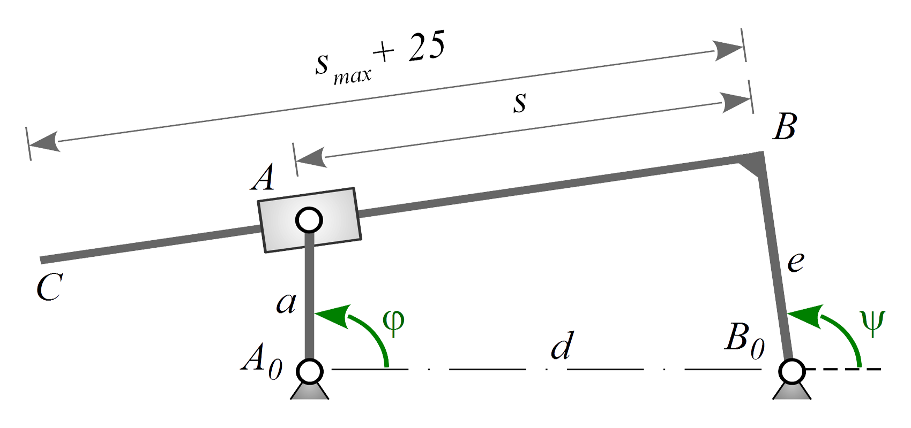
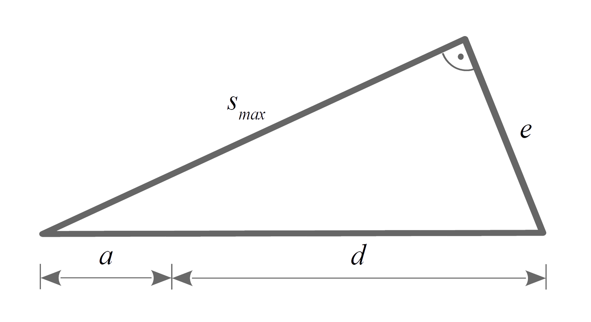

## Grundfall V

### Aufgabenstellung

Analysieren Sie den Mechanismus und stellen Sie ihn mit g2 interaktiv im Browser dar. Überlegen Sie dazu in welcher Lage $s_{max}$ erreicht wird und bestimmen Sie dieses.

Tipp: Wenn Sie durch überlegen nicht auf die entsprechende Stellung kommen, wählen Sie $s_{max}$ zuerst beliebig und ändern es wenn Sie sich das Verhalten des Mechanismus im Browser angeschaut haben. Alternativ lässt sich die Fragestellung auch numerisch lösen.

<figure>


#### Abb. 6.4: Gegebener Mechanismus

</figure>

Geg.: $a=50mm$, $d=3a$, $e=\frac{3}{2}a$, $0°<φ<360°$

### Mathematik

Um den Mechanismus interaktiv in ein Canvas zu rendern, benötigen wir die Koordinaten der Punkte $A$, $B$ und $C$
C in Abhängigkeit der Laufvariable $\varphi$.

Aufstellen der Maschengleichung und Sortieren nach Bekannten und Unbekannten liefert Grundfall V:

$$d\bm e_x + e\bm e_\psi + s\bm{\tilde e}_\psi - a\bm e_\varphi = \bm 0\ |\cdot(-1)\quad\Harr\quad -e\underline{\bm e_\psi} - \underline{s\bm{\tilde e}_\psi} = \bm g$$

mit

$$\bm g = d\bm e_x - a\bm e_\varphi = \begin{pmatrix}
d - a\cos\varphi\\-a\sin\varphi\end{pmatrix}$$

> #### Grundfall V:
>
> $$a\underline{\bm e_\alpha} - \underline{b\bm{\tilde e}_\alpha} = \bm c$$ 
>
> Lösung:
>
> $$b = \pm\sqrt{c^2 - a^2}\quad und\quad \bm e_\alpha = \frac{a\bm c + b\bm{\tilde c}}{c^2}$$

Mit getauschten Variablen ergibt sich für unseren Mechanismus

$$s = \pm\sqrt{g^2-(-e)^2}\quad und\quad \bm e_\psi = \frac{-e\bm g + s\bm{\tilde g}}{g^2}$$

Quadrieren der Hilfsgeraden $\bm g$ liefert

$$g^2=a^2+d^2−2ad\cos\varphi$$

Es folgen der unbekannte Winkel $\psi$ mit

$$\psi = \arctan_2\left[\frac{1}{g^2}(-e\cdot g_y +s\cdot g_x),\quad\frac{1}{g^2}(-e\cdot g_x + s\cdot(-g_y))\right]$$

Der größte Abstand zwischen den Punkten $A$ und $B$ also $s_{max}$ tritt bei $\varphi=180°$ auf.

<figure>


#### Abb. 6.5: Ermittlung von $s_{max}$

</figure>

Mit dem Satz des Pythagoras lässt sich $s_{max}$ leicht ermitteln:

$$(a+d)^2=s_{max}^2 + e^2 \quad\Harr\quad s_{max}=\sqrt{(a+d)^2-e^2}$$

Der Mechanismus ist nun vollständig bestimmt.

### Code

Wir legen wie immer eine neue HTML-Datei an, die unter anderem ein 400x300px Canvas sowie einen Range-Input inkl. Output für $\varphi$ enthält.

Diesmal legen wir die Gliedlängen des Mechanismus $a$, $d$, $e$ sowie $s_{max}$ allerdings außerhalb des mec-Objekts als Variablen an. Da die Gliedlängen alle von $a$
abhängen und sich niemals ändern, ist es überflüssig jene jedes Mal neu zu evaluieren, wenn sie abgefragt werden. Es ist wesentlich effizienter dies nur einmal beim Initialisieren zu tun.

```JavaScript
const
    //...
    a = 50, d = 3*a, e = 3/2*a,
    smax = Math.sqrt((a + d)*(a + d) - e*e),
    //...
```

Unser mec-Objekt enthält dann Getter für $bm e_\varphi$, $\bm g$, $g^2$, $s$, $\psi$, $\bm e_psi$ sowie für die Gelenk- und Gestellpunkte $A_0$, $B_0$, $A$, $B$, $C$.

Das mec-Objekt sollte so aussehen:

```JavaScript
mec = {
        get ephi() { return {x:Math.cos(phi), y:Math.sin(phi)}; },
        get g()   { return {x:d - a*Math.cos(phi), y:-a*Math.sin(phi)}; },
        get gg()  { return a*a + d*d - 2*a*d*Math.cos(phi); },
        get s() { return Math.sqrt(this.gg - e*e); },
        get psi() {
            return Math.atan2( (1/this.gg)*(-e*this.g.y + this.s*this.g.x), (1/this.gg)*(-e*this.g.x - this.s*this.g.y) )
        },
        get epsi() { return { x:Math.cos(this.psi), y:Math.sin(this.psi)}; },
 
        // Gelenkpunkte
        A0: {x:0, y:0},
        get B0() { return {x:d, y:0}; },
        get A() { return {x:a*this.ephi.x, y:a*this.ephi.y}; },
        get B() { return {x:this.B0.x + e*this.epsi.x, y:this.B0.y + e*this.epsi.y}; },
        get C() { return {x:this.B.x + (smax + 40)*(- this.epsi.y), y:this.B.y + (smax + 40)*this.epsi.x}; }
    }
```

Es folgen nach alt bekannten Schema Anpassungen am world-Objekt

```JavaScript
world = g2().clr()
            .view({cartesian:true,x: 150,y: 180}) // Nullpunkt verschoben   
            .use({grp:g})
            .nodfix({x:0,y:0})
            .nodfix(mec.B0),
```

und der Funktion position()

```JavaScript
function position() {
    g.del()
     .beam2({pts:[mec.B0.x, mec.B0.y, mec.B.x, mec.B.y, mec.C.x, mec.C.y]})
     .slider({...mec.A, w: (mec.psi+pi/2), fs:"@nodfill"})
     .bar2({x1: mec.A0.x,y1:mec.A0.y, x2:mec.A.x,y2:mec.A.y})
     .nod(mec.A)
}
```

### Ergebnis

Der fertige Quelltext sollte folgendermaßen aussehen:

```HTML
<!doctype html>
<html>
<head>
    <meta charset='utf-8'>
    <title>Kurbelschleife</title>
</head>
 
<body>
    <h2>Kurbelschleife - Grundfall 5</h2>
    <canvas id="c" width="400" height="300" style="border-width:1px;border-style:solid"></canvas>
    <br>
    <label for="phislider">&phi;:
    <input type="range" id="phislider" style="width:330px;vertical-align:middle;padding:0" min="0" max="360" value="0">
    <output id="phiout" for="phislider">0</output>°
    </label>
 
    <script src="https://gitcdn.xyz/repo/goessner/g2/master/src/g2.js"></script>
 
    <script>
 
const cnv = document.getElementById('c'),
    ctx = cnv.getContext('2d'),
    phislider = document.getElementById('phislider'),
    phiout = document.getElementById('phiout'),
 
    pi = Math.PI,
    a = 50, d = 3*a, e = 3/2*a,
    smax = Math.sqrt((a + d)*(a + d) - e*e),
 
    mec = {
        get ephi() { return {x:Math.cos(phi), y:Math.sin(phi)}; },
        get g()   { return {x:d - a*Math.cos(phi), y:-a*Math.sin(phi)}; },
        get gg()  { return a*a + d*d - 2*a*d*Math.cos(phi); },
        get s() { return Math.sqrt(this.gg - e*e); },
        get psi() {
            return Math.atan2( (1/this.gg)*(-e*this.g.y + this.s*this.g.x), (1/this.gg)*(-e*this.g.x - this.s*this.g.y) )
        },
        get epsi() { return { x:Math.cos(this.psi), y:Math.sin(this.psi)}; },
 
        // Gelenkpunkte
        A0: {x:0, y:0},
        B0: {x:d, y:0},
        get A() { return {x:a*this.ephi.x, y:a*this.ephi.y}; },
        get B() { return {x:this.B0.x + e*this.epsi.x, y:this.B0.y + e*this.epsi.y}; },
        get C() { return {x:this.B.x + (smax + 25)*(- this.epsi.y), y:this.B.y + (smax + 25)*this.epsi.x}; }
    },
 
    g = g2(),
 
    // baut und initialisiert statische Umgebung
    world = g2().clr()
                .view({cartesian:true,x:150,y:150})
                .use({grp:g})
                .nodfix({x:0,y:0})
                .nodfix(mec.B0);
 
let phi = 0, // Laufvariable 
    dirty = true;  // wenn true gibt es was zu aktualisieren
 
 
function position() {
    g.del()
     .beam2({pts:[mec.B0.x, mec.B0.y, mec.B.x, mec.B.y, mec.C.x, mec.C.y]})
     .slider({...mec.A,w:(mec.psi+pi/2),fs:"@nodfill"})
     .bar2({x1:mec.A0.x,y1:mec.A0.y,x2:mec.A.x,y2:mec.A.y})
     .nod(mec.A)
}
 
function render() {
    if (dirty) {
        position();  // aktualisiere Position
        world.exe(ctx);  // rendert world in den Context
        dirty = false;
    }
    requestAnimationFrame(render);  // asynchroner callback von render(), keine Rekursion!
}
 
function setPhi() {
    if (phislider.value != phiout.value) {
        phi = phislider.value*pi/180;
        phiout.innerHTML = phislider.value;
        dirty = true;
    }
}
 
/*
 *  Initialisierung
 */
 
// Eventlistener hinzufuegen
phislider.addEventListener("input",setPhi);
 
// Animation starten
render();
 
    </script>
</body>
</html>
```

<iframe width=100% height=420 frameborder='no' src='https://goessner.github.io/webkinematik/Grundfaelle/Fall 5/Grundfall_5-Kurbelschleife.html'></iframe>
